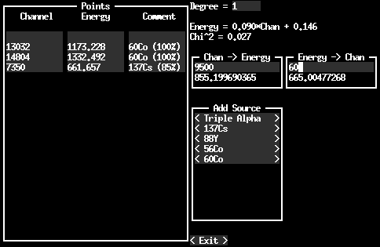

A TUI for use in calibrating energy spectra.

This program is designed for performing linear fits for calibrating energy spectra.
Once calibration points have been given, it can convert between energy and channel numbers.
In addition, it has several predefined sources, useful for calibrating gamma detectors.